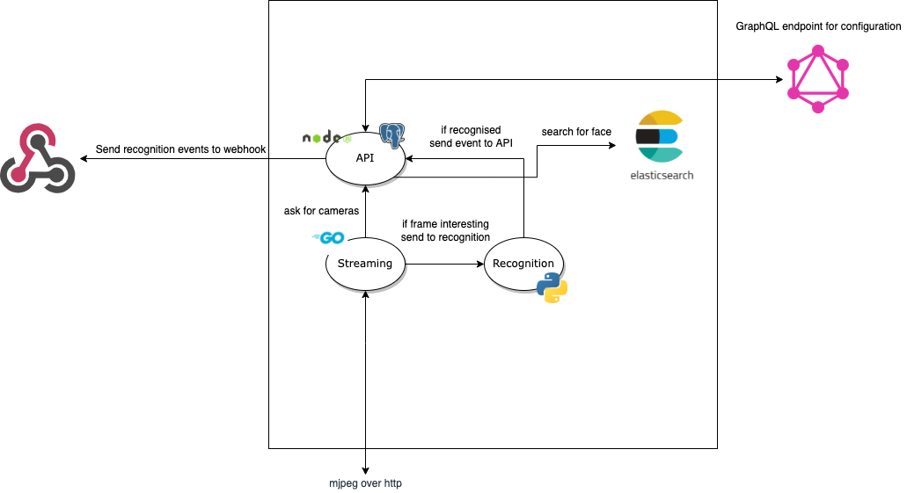

# Streamity

Realtime face recognition for remote cameras

## Architecture

## Containers

- [recognition](https://github.com/users/0x77dev/packages/container/package/streamity%2Frecognition) - transforms faces into data to recognize it _(CUDA compatible)_
  - Depends on:
    - nats
- [stream](https://github.com/users/0x77dev/packages/container/package/streamity%2Fstream) - consumes cameras video feed and emits interesting frames to recognition
  - Depends on:
    - nats
- [api](https://github.com/users/0x77dev/packages/container/package/streamity%2Fapi) - provides data for other services such as cameras, queries for face in elasticsearch and GraphQL api
  - Depends on:
    - nats
    - elasticsearch
    - postgresql

_See compose examples in [`./docker`](./docker)_

### License

See [`./LICENSE`](./LICENSE)

Copyright 2021 Mykhailo Marynenko
